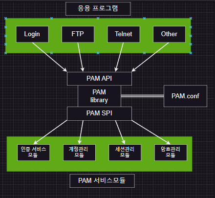
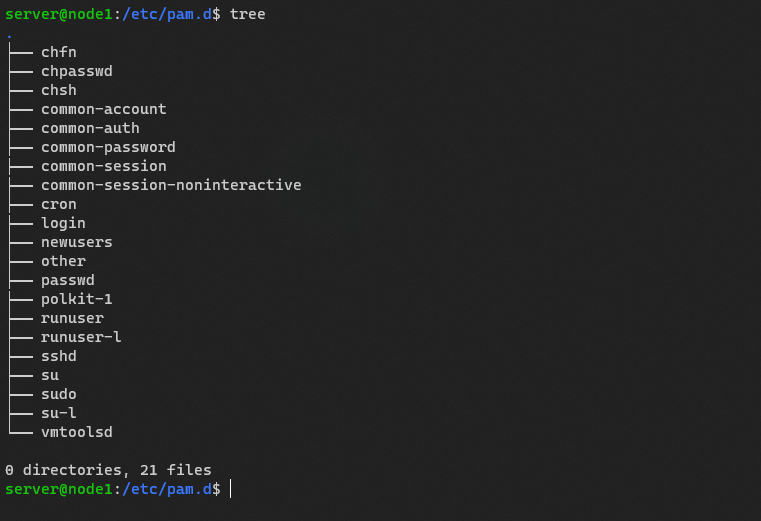

# PAM(Pluggable Authentication Modules)
PAM은 "Pluggable Authentication Modules"의 약어로, 리눅스와 유닉스 기반 시스템에서 사용자 인증 및 권한 관리를 담당하는 프레임워크입니다.

PAM은 시스템의 인증과 권한 부여 과정을 모듈화하여, 시스템에서 사용되는 여러 인증 방법과 권한 부여 방법을 모듈로 구현할 수 있습니다.  
이러한 모듈은 필요에 따라 로드되어, 사용자 인증 및 권한 부여에 대한 다양한 옵션을 제공합니다.

PAM은 다양한 인증 방법을 지원합니다. 예를 들어, 패스워드, Smart Card, LDAP 등의 인증 방법을 모듈로 구현하여 사용할 수 있습니다.  
또한, 시스템 권한 부여 방법을 지원하여, 로그인 시 적용되는 보안 정책 및 사용자 권한을 설정할 수 있습니다.

PAM은 리눅스와 유닉스 기반 시스템에서 매우 중요한 역할을 합니다. PAM을 사용하여, 시스템 관리자는 사용자 인증 및 권한 관리에 대한 다양한 옵션을 제공할 수 있으며, 이를 통해 시스템 보안성을 강화할 수 있습니다. 또한, PAM을 사용하여 시스템 접근 제어 및 권한 부여 정책을 구현할 수 있습니다.

  
  

# PAM Strcuture

# Module Type

# control flag

# Module Name

# Module Arguments

  