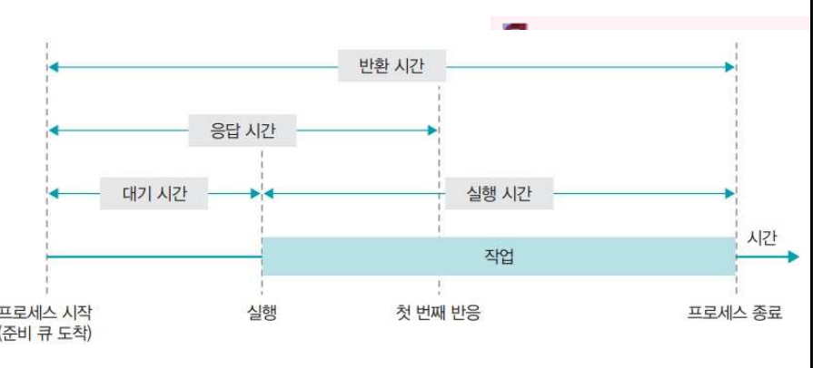

# 스케줄링(Scheduling)

## 정의
* 프로세스들에 대하여 CPU에 할당 기회를 결정하고 수행하는 과정이다
* 프로세스가 작업을 처리하기 위해 CPU 할당을 위한 일정을 처리를 해준다.

## 목적
* 공정성
* 처리율 증가
* cpu 이용률 증가
* 우선순위 제도: 우선순위가 높은 프로세스를 먼저 실행한다. 
* 오버헤드 최소화
* 응답 시간(Response 반응시간) 최소화
* 반환 시간 최소화
* 대기 시간 최소화
* 균형 있는 자원의 사용
* 무한 연기 회피

# 스케줄링의 성능 평가

## 높아야 좋은것 
1. CPU 이용률 
2. 처리 능력(Throughput) 

## 낮아야 좋은것 

1. 대기 시간
    * 프로세스가 생성된 후 실행되기 전 까지 대기하는 시간
2. 응답 시간
    * 첫 작업을 시작한 후 첫 번째 출력(반응)이 나오기까지의 시간
3. 실행 시간
    * 프로세스 작업이 시작된 후 종료 되기까지의 시간
4. 반환 시간
    * 대기 시간을 포함하여 실행이 종료될 때까지의 시간 

# 스케줄러란?

어떤 프로세스에게 자원을 할당할지를 결정하는 운영체제 커널의 모듈을 지칭

# 스케줄러의 종류

장기 스케줄러 (= 작업 스케줄러)

    어떤 프로세스를 준비 큐에 삽입할지 결정 (메모리와 디스크 사이의 스케줄링을 담당)
    디스크에서 하나의 프로그램을 가져와 커널에 등록하면 프로세스가 되는데, 이때 디스크에서 어떤 프로그램을 가져와 커널에 등록할지(준비 큐에 등록할지) 결정
    수십 초 내지 수 분 단위로 가끔 호출되므로 상대적으로 느린 속도를 허용

    프로세스의 상태 : new -> ready (in memory)

단기 스케줄러 (= CPU 스케줄러)

     준비 상태의 프로세스 중에서 어떤 프로세스를 다음 순서로 실행할 것인지 결정 (cpu와 메모리 사이의 스케줄링을 담당)
    일반적으로 스케줄러 = 단기 스케줄러
    단기 스케줄러는 미리 정한 스케줄링 알고리즘에 따라 cpu를 할당할 프로세스를 선택
    단기 스케줄러는 밀리 세컨드(ms) 이하의 시간 단위로 매우 빈번하게 호출 -> 수행 속도가 충분히 빨라야 함

    프로세스의 상태 : ready -> running -> waiting -> ready

 중기 스케줄러

    너무 많은 프로세스에게 메모리를 할당해서 시스템의 성능이 저하되는 경우 이를 해결하기 위해 메모리에 적재된 프로세스의 수를 동적으로 조절하기 위해 추가된 스케줄러
    메모리에 많은 수의 프로세스가 적재하면 프로세스 당 보유하고 있는 메모리량이 극도로 적어짐
    CPU 수행에 당장 필요한 프로세스의 주소 공간조차도 메모리에 올려놓기 어려운 상황이 발생
    디스크 I/O가 수시로 발생
    시스템의 성능이 심각하게 저하됨
    메모리에 올라와 있는 프로세스 중 일부의 메모리를 통째로 빼앗아 그 내용을 디스크의 스왑 영역에 저장

    -> 스왑 아웃(swap out)

    중기 스케줄러의 등장으로 프로세스의 상태에는 중지 상태가 추가되었으며, 중지 상태의 프로세스는 메모리를 통째로 빼앗기고 디스크로 스왑 아웃된다.
    중지 준비 상태 : 준비 상태의 프로세스가 중기 스케줄러에 의해 디스크로 swap out
    봉쇄 중지 상태 : 봉쇄 상태의 프로세스가 중기 스케줄러에 의해 디스크로 swap out

    중지 봉쇄 상태이던 프로세스가 봉쇄 되었던 조건을 만족하게 되면 이 프로세스의 상태는 중지 준비 상태로 바뀌게 된다 중지 상태에 있는 프로세스들은 중지 준비 상태이든 중지 봉쇄 상태이든 관계없이 메모리를 조금도 보유하지 않고 디스크에 통째로 스왑 아웃된 상태로 존재하게 된다.
    프로세스의 상태 : ready -> suspended

# 스케줄링 종류 

1. 선점 스케줄링

 1-1. SRT(Shortest Remaining Time) 스케줄링: 짧은 시간 순서대로 프로세스를 수행한다. 남은 처리 시간이 더 짧은 프로세스가 Ready 큐에 들어오면 그 프로세스가 바로 선점됨. 아래에 소개할 SJF의 선점 버전이라고 할 수 있다.

 1-2. 라운드로빈(Round-Robin)스케줄링: 각 프로세스는 같은 크기의 CPU 시간을 할당 받고 선입선출에 의해 행된다. 할당시간이 너무 크면 선입선출과 다를 바가 없어지고, 너무 작으면 오버헤드가 너무 커진다.

1-3. 다단계 큐(Multi-level Queue) 스케줄링: Ready큐를 여러 개 사용하는 기법. 각각의 큐는 자신의 스케줄링 알고리즘을 수행하며, 큐와 큐 사이에도 우선순위를 부여한다.

1-4. 다단계 피드백 큐 스케줄링: 다단계 큐와 비슷하나 프로세스들이 큐를 이동할 수 있다.

2. 비선점 스케줄링

1-1.  HRN(Highest response ratio next) 스케줄링: 긴 작업과 짧은 작업간의 지나친 불평등을 어느 정도 보완한 기법. 수행시간의 길이와 대기 시간을 모두 고려해 우선순위를 정한다.

1-2. SJF(Shortest Job First) 스케줄링: 큐 안에 있는 프로세스 중 수행시간이 짧은 것을 먼저 수행. 평균 대기 시간을 감소시킨다.

1-3. 우선순위(priority) 스케줄링: 프로세스에게 우선순위를 정적, 혹은 동적으로 부여하여 우선순위가 높은 순서대로 처리한다. 동적으로 부여할 경우, 구현이 복잡하고 오버헤드가 많다는 단점이 있으나, 시스템의 응답속도를 증가시킨다.

1-4. 기한부(Deadline) 스케줄링: 작업을 명시된 시간이나 기한 내에 완료하도록 계획.

1-5. FIFO 스케줄링: 프로세스들은 Ready큐에 도착한 순서대로 CPU를 할당 받는다. 작업 완료 시간을 예측하기 매우 용이하다. 하지만 덜 중요한 작업이 중요한 작업을 기다리게 할 수도 있다.

# 디스크 스케줄링의 개요
사용할 데이터가 디스크상의 여러 곳에 저장되어 있을 경우 데이터를 액세스하기 위해 디스크 헤드가 움직이는 경로를 결정하는 기법
## 목적 
* 처리량의 최대화
* 응답 시간의 최소화
* 응답 시간 편차의 최소화

# 디스크 스케줄링 시 발생하는 병목현상 제거 방법 
* 제어장치가 포화상태가 되면 해당 제어장치에 부착된 디스크의 수를 감소시킴
* 입출력 채널이 복잡하면 그 채널에 부착된 제어장치 중 몇 개를 다른 채널로 이동
* 입출력 채널이 복잡하면 채널을 추가

## FIFO(=FCFS) 
* 디스크 대기 큐에 가장 먼저 들어온 트랙에 대한 요청을 먼저 서비스하는 기법
* 디스크 대기 큐에 있는 트랙 순서대로 디스크 헤드를 이동
* 디스크 대기 큐에 들어온 순서대로 서비스를 하기 때문에 공평성이 보장됨
# FIFO 기법 적용 예   
<현재 헤드의 위치가 50에 있고, 요청 대기 열에는 아래와 같은 순서로 들어 있다고 가정>

* 이동순서: 50→100→180→40→120→0→130→70→80→150→200
* 헤드의 이동 거리: 790 (50+80+140+80+120+130+60+10+70+50)

## SSTF(Shortest Seek Time First) 
탐색거리가 가장 짧은 트랙에 대한 요청이 먼저 서비스 받는 기법

* 현재 헤드 위치에서 가장 가까운 거리에 있는 트랙으로 헤드를 이동시킴
* 처리량이 많은 일괄 처리 시스템에 유용
* 현재 서비스한 트랙에서 가장 가까운 트랙에 대한 서비스 요청이 계속 발생하는 경우, 먼 거리의 트랙에 대한 서비스는 무한정 기다려야 하는 기아상태가 발생할 수 있음
* 응답 시간의 편차가 크기 때문에 대화형 시스템에는 부적합

### SSTF 기법 적용 예   
<현재 헤드의 위치가 50에 있고 트랙 0번 방향으로 이동하며, 
 요청 대기열에는 아래와 같은 순서로 들어 있다고 가정>

* 이동순서: 50→40→70→80→100→120→130→150→180→200→0
* 헤드의 총 이동거리: 370 (10+30+10+20+20+10+20+30+20+200)

## SCAN 
* 현재 진행 중인 방향으로 가장 짧은 탐색 거리에 있는 요청을 먼저 서비스하는 기법
* 현재 헤드의 위치에서 진행 방향이 결정되면 탐색 거리가 짧은 순서에 따라 그 방향의 모 든 요청을 서비스하고, 끝까지 이동한 후 역방향으로 서비스 함
* 헤드의 진행 방향에 있는 대기 요청뿐만 아니라 새로운 요청도 서비스하며, 현재의 진행 방향에 더 이상의 요청이 없을 때에만 이동 방향을 바꿈
* SSTF에서 발생하는 응답 시간의 편차를 줄임

### SCAN 기법 적용 예 
<현재 헤드의 위치가 50에 있고 트랙 0번 방향으로 이동하며, 요청 대기 열에는 아래와 같은 순서로 들어 있다고 가정>   

* 이동순서: 50→40→0→70→80→100→120→130→150→180→200
* 헤드의 총 이동거리: 250 (10+40+70+10+20+20+10+20+30+20)

## C-SCAN 
* 항상 바깥쪽에서 안쪽으로 움직이면서 가장 짧은 탐색 거리를 갖는 요청을 서비스 하는 기법
* 헤드는 트랙의 바깥쪽에서 안쪽으로 한 방향으로만 움직이며 서비스하여 끝까지 이동한 후, 안쪽에 더 이상의 요청이 없으면 헤드는 가장 바깥쪽의 끝으로 이동한 후 다시 안쪽 으로 이동하면서 요청을 서비스함
* 요청을 서비스하는 도중 새로운 요청이 도착하면 다음 헤드가 진행할 때 서비스함
* 트랙의 안쪽과 바깥쪽의 요청에 대한 서비스가 공평함

### C-SCAN 기법 적용 예 
 <현재 헤드의 위치가 50에 있고, 트랙 0번 방향으로 이동하며, 요청 대기 열에는 아래
 와 같은 순서로 들어 있다고 가정>

 

* 이동순서 : 50→40→0→200→180→150→130→120→100→80→70
* 총 헤드의 이동 거리: 380 (10+40+200+20+30+20+10+20+20+10)

## N-step SCAN 
* SCAN 기법을 기초로 하며 어떤 방향의 진행이 시작될 당시에 대기중이던 요청에 대해서만 서비스하고 진행 도중 도착한 요청들은 반대 방향 진행 때 서비스하는 기법
* SSTF나 SCAN 기법보다 응답 시간의 편차가 적음
* 특정 방향에 많은 수의 요청이 도착할 경우 반대 방향에서의 무한 지연을 방지함
## Look 
SCAN 기법을 사용하되 진행 방향의 마지막 요청을 서비스한 후 그 방향의 끝으로 이동하는 것이 아니라 바로 역방향으로 진행하는 기법
## C-Look
C-SCAN 기법을 사용하며 안쪽 방향의 모든 요청을 처리한 후 바깥쪽 맨 끝으로 이동하는 것이 아니라 가장 바깥쪽의 요청 트랙으로 이동한 후 진행하는 기법
요점정리