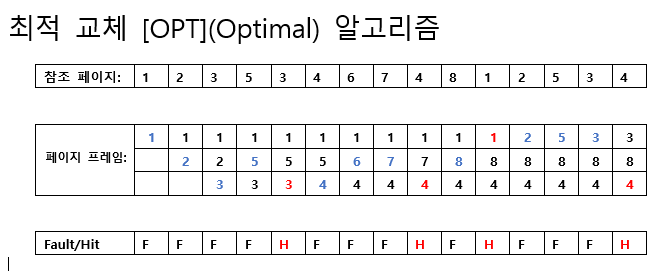
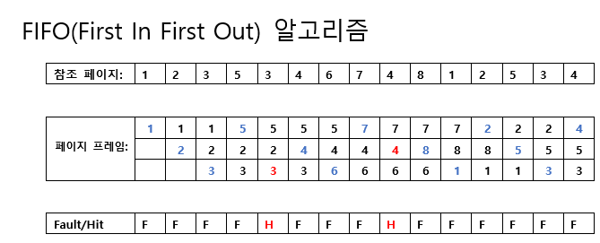
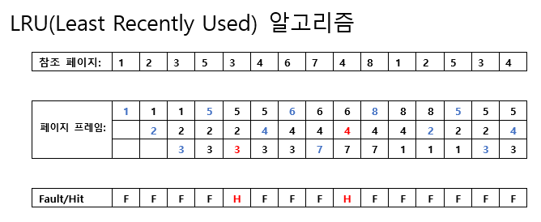
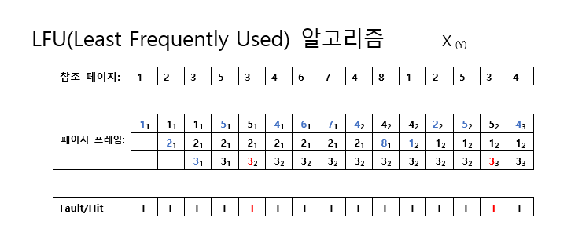

# OPT(Optimal Page Replacement)

* 가장 최적의 페이지 교체 알고리즘
* 알고리즘이 실행되는 동안 미래의 참조 패턴을 예측하여 가장 늦게 사용될 페이지를 선택하여 교체함
* 최적의 결과를 보장하지만, 미래의 참조 패턴을 미리 예측하는 것은 불가능하기 때문에 구현이 어렵고 비현실적일 수 있음

# FIFO(First In First Out)

* 가장 간단한 페이지 교체 알고리즘
* 페이지를 캐시에 넣은 순서대로 교체함
* 페이지가 캐시에 먼저 들어온 순서대로 교체되기 때문에 오래된 페이지가 새로운 페이지보다 더 자주 교체될 수 있음
* 구현이 간단하지만, 페이지 교체의 공정성이 낮아져서 페이지 부재율이 높아질 수 있음

# LRU(Least Recently Used)

* 가장 오래전에 사용되었던 페이지를 교체하는 알고리즘
* 페이지가 캐시에서 사용된 순서를 추적하고, 가장 오래 전에 사용된 페이지를 교체함
* 최근에 사용되지 않은 페이지를 우선적으로 교체하여 페이지 부재율을 줄일 수 있음
* 구현이 복잡할 수 있지만, 일반적으로 최적의 성능을 보장하는 알고리즘 중 하나임

# LFU(Least Frequently Used) 

* 사용 빈도가 가장 적은 페이지를 교체하는 알고리즘
* 각 페이지가 사용된 빈도수를 추적하고, 사용 빈도가 가장 적은 페이지를 교체함
* 최근에 자주 사용되었더라도 전체적인 사용 빈도가 낮은 페이지가 교체될 수 있음
* 구현이 어렵고, 캐시의 크기가 작을 경우 성능이 저하될 수 있음