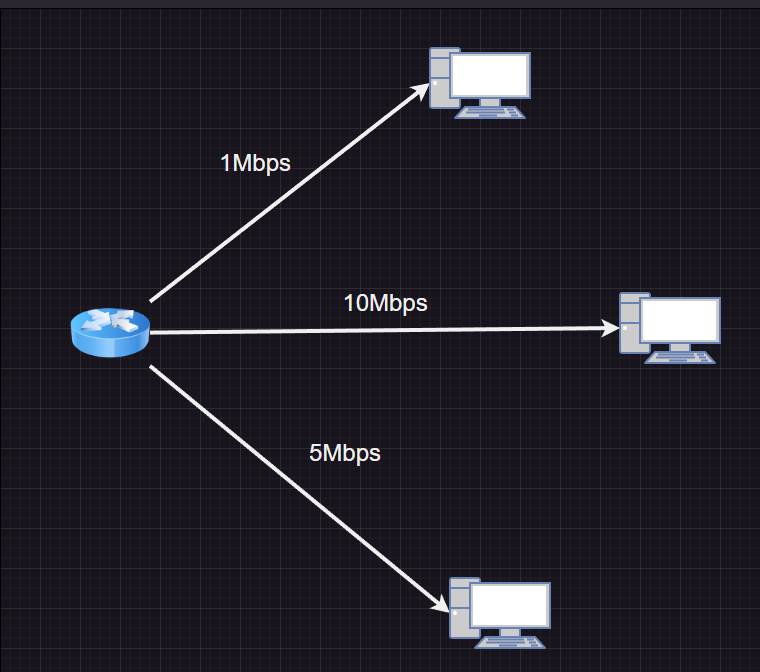

# QOS
네트워크의 속도를 조절하는 기술로 쉽게 생각하면 A컴퓨터에는 1Mbps B컴퓨터에는 2Mbps로 제어하는 기술이다.  

# QoS가 제공하는 기능
* QoS는 기본적으로 오늘날의 패킷 기반 네트워크에서 트래픽을 관리하기 위한 것이며 다음과 같은 기능을 포함합니다.
* 프로토콜, 주소 및 포트 번호를 기준으로 트래픽 간의 우선 순위를 정합니다.
* 수신 또는 송신 시 트래픽을 필터링합니다.
* 디바이스에서 전송 또는 수신이 허용되는 대역폭을 제어합니다.
* 패킷 헤더에서 QoS 동작 요구 사항을 읽고 씁니다.
* 디바이스가 스케줄러 우선 순위를 기준으로 가장 높은 우선 순위의 트래픽을 보내도록 정체를 제어합니다.
* 디바이스가 어떤 패킷을 삭제하거나 처리해야 하는지를 알 수 있도록 RED(Random Early Detection) 알고리즘을 사용하여 패킷 손실을 제어합니다.

# QoS 작동 방식
* 라우터나 스위치 같은 네트워크 디바이스는 다음과 같이 트래픽을 구별합니다.
* 수신 인터페이스에서 패킷을 수신하고, 패킷을 검사하며 CoS(Classes of Service)라는 그룹으로 트래픽을 분류합니다.
* 옵션인 폴리서가 구성된 경우에는 트래픽을 제한하거나 다른 클래스에 할당합니다.
* 대기열에는 전송 리소스를 기다리고 있는 패킷이 보관됩니다.
* 스케줄러는 패킷을 대기열에서 꺼내 스케줄러에 구성된 순서대로 전송합니다.
* 셰이퍼가 구성된 경우 트래픽을 구성된 셰이핑 속도에 맞춰 트래픽을 셰이핑합니다.
* 설명이 구성된 경우, 패킷을 수신할 다음 디바이스에서 분류 방법을 파악할 수 있도록 디바이스가 IP 헤더의 DS 필드의 값을 설명합니다.