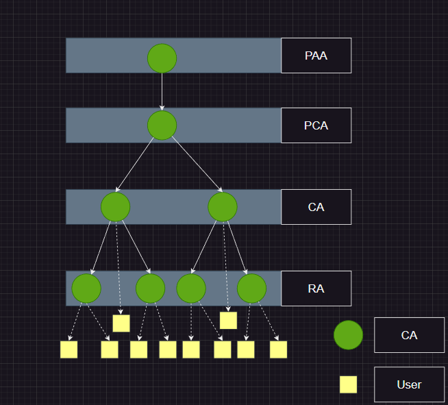

# 공인인증서

# 구성요소
| Component           | Description                                                                                 |
|---------------------|---------------------------------------------------------------------------------------------|
| Subject             | The entity to which the certificate belongs, such as an individual or an organization.      |
| Public Key          | The public key associated with the subject.                                                 |
| Signature Algorithm | The algorithm used to generate the digital signature on the certificate.                    |
| Issuer              | The entity that issued the certificate, such as a certificate authority (CA).               |
| Serial Number       | A unique identifier for the certificate.                                                    |
| Validity Period     | The time period during which the certificate is considered valid.                           |
| Extensions          | Additional information about the certificate, such as the purpose for which it can be used. |
| Signature           | A digital signature generated by the issuer to verify the authenticity of the certificate.  |