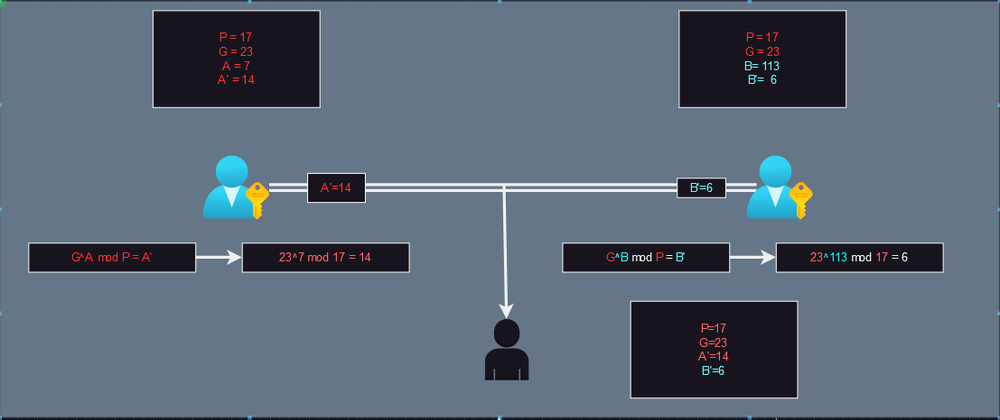
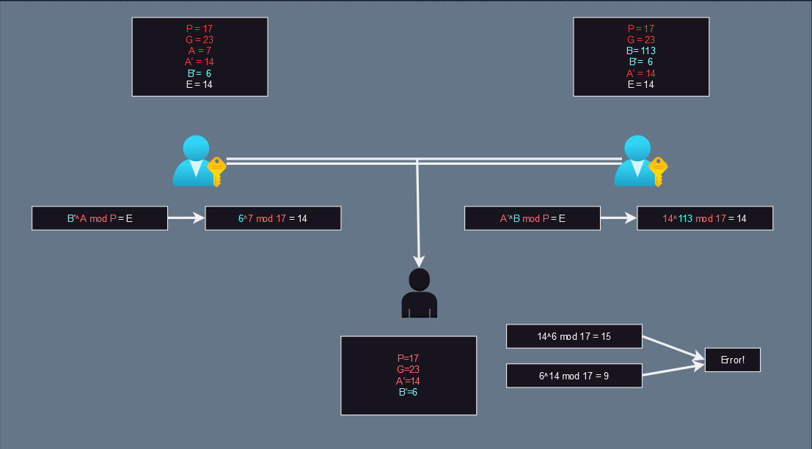
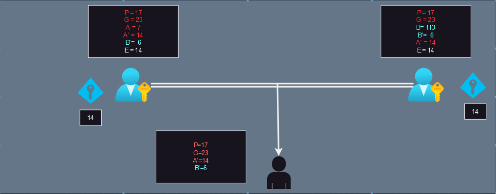
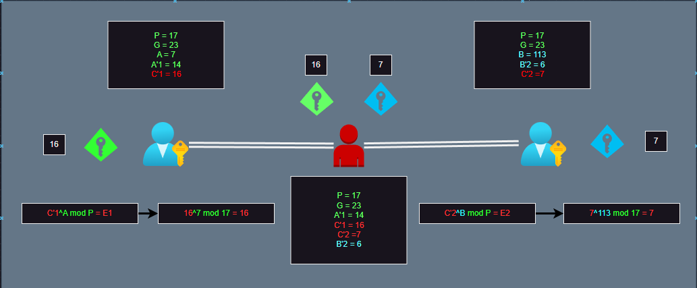

# Diffie_Hellman
대표적인 비대칭 키교환 알고리즘입니다. `이산대수`의 난재를 이용한 암호화 방식입니다.

# 키교환 과정
  
  
  

공격자가 스니핑을 한다는 과정하에 private key로 암호를 해독할수있는 키가 안전하게 전송되는 과정이다.  
물론 diffie-Hellman 알고리즘은 딱봐도 알겠지만 중간자 공격에 의한 취약점이 명확합니다.  

# 공격과정
  

공격자는 MITM으로 공개키를 조작하여 각 비밀키를 중간에서 2개를 만듭니다.
이러한 공격은 전달자의 무결성이 제대로 보증되지 않아서 발생한것입니다.  
Alice와 BOB이 아닌 Mallory가 보내는지 제대로된 확인이 불가능하여 체크하지 못하는 구조적 한계입니다.  
스니핑으로 공개키를 조작하지 않는다는 가정하에는 안전한 방식이지만 MITM이 meltdown이나, Hertzbleed Attack같은 매우 높은수준의 기술을 요구하는 공격방식이 아닌  
프록시라는 간단한 공격으로 패킷을 우회를 이용한 공격으로도 충분히 가로챌수 있기에 충분히 현실성 있는 취약점 입니다.  
대처 방법은 공인인증서를 이용한 서명인증으로 인하여 무결성을 검증하고 부인을 방지하는 방법입니다.  

여기서 당연하게도 교환하지않는 A와 B는 알지못합니다. 그럼에도 취약한건 여기서 발생하는 A'와 B'의 위조로 Alice와 BOB에게 잘못된 Public key를 보내어  
마치 Alice와 BOB에게 키를 전달하여 받은것처럼 꾸며 Private 키를 만든다는겁니다. 키 자체는 잘 작동하는데 Mallory또한 키를 사용할수있는 취약점이 발생하는겁니다.  
공격자가 마치 Alice -> BOB처럼 키를 만들듯이 하는거죠.  
