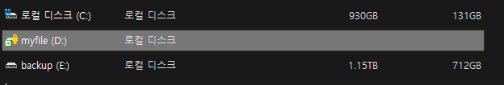

# Bitlock

비트락은 하드디스크 암호화 기술이다. MS에서 개발했으며 윈도우에 내장된 암호화 기능이다.  
핵심은 하드디스크의 한 파티션을 통째로 암호화하여 키가없는 사용자는 하드디스크를 가져가더라도 복호화를 못하는 강력한 기능을 가지고있다.  
보안상 중요한 파일이나 나만 보고싶은 파일을 저장하는데 bitlock을 사용하는것을 추천하며 usb또한 마찬가지고 bitlock으로 암호화 가능하다.  
비대칭키 기반 기능이자 대칭키 기반에 쓰가 기능이기에 키는 windows 계정에 저장할수도 있으며, 신뢰할수있는 하드디스크에도 저장할수있다.  
기본은 패스워드를 통한 암호화이며 그렇기에 강도높은 패스워드를 사용하는것을 추천한다. 1234와 같은것은 사전대입공격으로 뚫릴 확률이 높기 떄문이다.  

# 개인적으로 
베라스크립트와 많이 비교되지만 나는 개인적으로 윈도우를 사용한다면 bitlock이 더 안정적이고 보안성이 좋다고 생각하기에... 주관적일뿐 