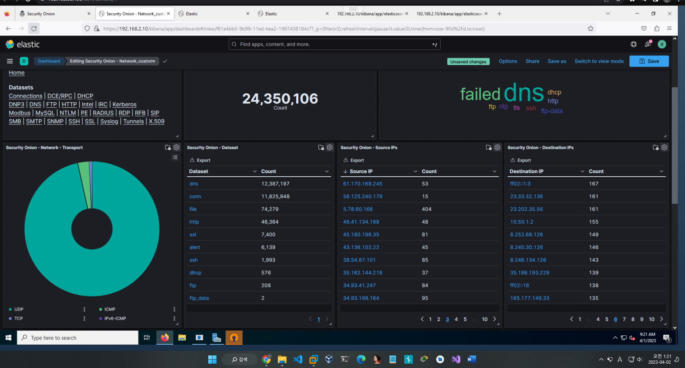

# Kibana

Kibana는 오픈소스 데이터 분석 및 시각화 도구로, Elasticsearch를 기반으로하는 데이터 분석, 시각화 및 검색 기능을 제공합니다. Kibana를 사용하면 Elasticsearch 데이터를 쉽게 탐색, 분석, 시각화하고 대시보드를 생성할 수 있습니다.

Kibana는 사용자가 데이터를 쉽게 이해할 수 있도록 다양한 시각화 옵션을 제공합니다. 예를 들어, Kibana를 사용하여 데이터를 바 차트, 라인 차트, 원형 차트 등으로 시각화할 수 있습니다. 또한, 사용자가 원하는 방식으로 데이터를 필터링하고 쿼리할 수 있으며, 사용자가 구성 가능한 대시보드를 만들 수 있습니다.

Kibana는 대시보드를 생성하고 관리하는 데 매우 유용한 도구입니다. 사용자는 Elasticsearch 데이터를 대시보드에 추가하고 필터링하며, 이를 시각적으로 나타내기 위해 차트, 그래프, 지도 등을 사용할 수 있습니다. 또한, 대시보드를 공유하고 다른 사용자와 협업할 수 있습니다.

마지막으로, Kibana는 Elasticsearch와의 강력한 통합성을 제공합니다. Elasticsearch 데이터를 분석하고 시각화하기 위한 기능뿐만 아니라, Elasticsearch의 모니터링 및 진단 기능도 제공합니다. 이를 통해 사용자는 Elasticsearch 클러스터의 상태와 성능을 모니터링하고 문제를 진단할 수 있습니다.

